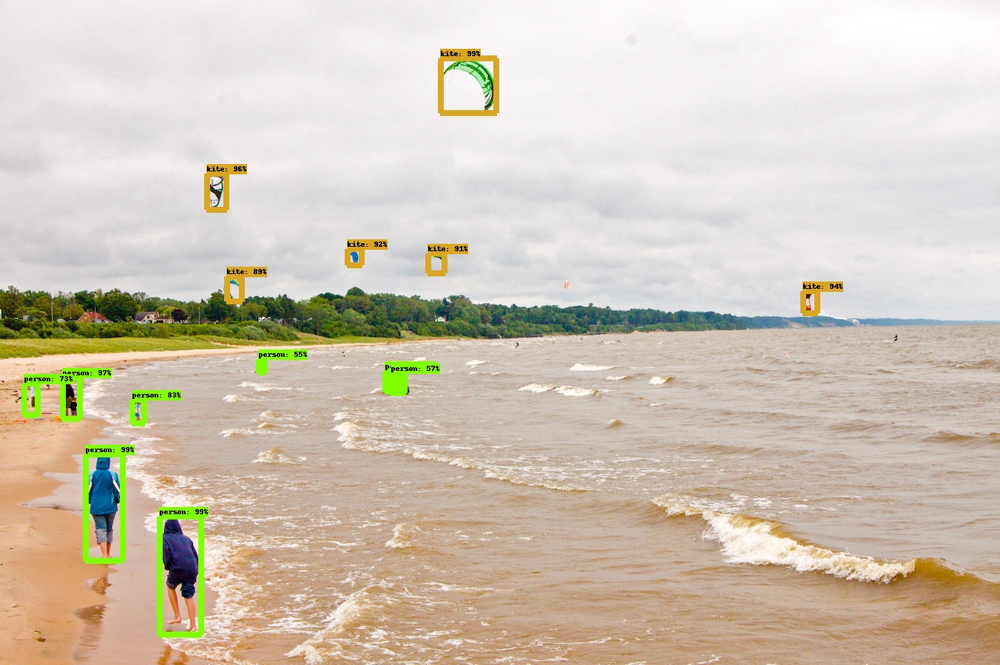

# object-detection
Object-Detection API using MSCOCO dataset from Tensorflow

## How to install 
[Object-Detection API Install Guide](https://github.com/tensorflow/models/blob/master/research/object_detection/g3doc/installation.md)
### protocol buffer test
```
$ conda activate mondeique
(mondeique) $ sudo apt-get install protobuf-compiler python-pil python-lxml python-tk
(mondeique) $ sudo pip install pillow
(mondeique) $ sudo pip install jupyter
(mondeique) $ sudo pip install matplotlib 
```
- 편의를 위해 conda virtualenv는 생략했다. (mondeique)
- Object Detection API는 protocol buffer를 이용한다. 
```
$ git clone http://github.com/tensorflow/models
$ cd models/research

$ protoc object_detection/protos/*.proto --python_out=.
```
- 환경변수를 설정해준다.
```
$ export PYTHONPATH=$PYTHONPATH:`pwd`:`pwd`/slim
```
- 설치가 제대로 되었는지 확인한다. 
```
$ python object_detection/builders/model_builder_test.py
```
## How to run 
```
$ CUDA_VISIBLE_DEVICES=0 python object_detection_run.py
```
or
```
$ CUDA_VISIBLE_DEVICES=0 python object_detection_ssd_run.py
```
## Test Result
### Faster R-CNN resnet101


- 전체적으로 괜찮은 성능을 보였으나 그대로 자르기에는 많이 부족한 부분이 보인다.
## TODO 

- [X] dev env setting (ubuntu 18.04) : decide on 2019.10.09
- [X] GPU testing
- [X] protobuf testing : 2019.10.10
- [X] Object-Detection API test with faster rcnn resnet101 : 2019.10.10
