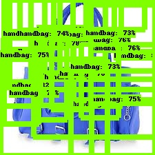

# object-detection
Object-Detection API using MSCOCO dataset from Tensorflow & customized object-detection

## How to install 
[Object-Detection API Install Guide](https://github.com/tensorflow/models/blob/master/research/object_detection/g3doc/installation.md)
```
$ sudo pip install -r requirements.txt
```
### protocol buffer test
```
$ conda activate mondeique
(mondeique) $ sudo apt-get install protobuf-compiler python-pil python-lxml python-tk
(mondeique) $ sudo pip install pillow
(mondeique) $ sudo pip install jupyter
(mondeique) $ sudo pip install matplotlib 
```
> 편의를 위해 conda virtualenv는 생략했다. (mondeique)
- Object Detection API는 protocol buffer를 이용한다. (실행시 아래 test를 계속 해줘야 한다)
```
$ git clone http://github.com/tensorflow/models
$ cd models/research

$ protoc object_detection/protos/*.proto --python_out=.
```
- 환경변수를 설정해준다.
```
$ export PYTHONPATH=$PYTHONPATH:`pwd`:`pwd`/slim
```
- 설치가 제대로 되었는지 확인한다. 
```
$ python object_detection/builders/model_builder_test.py
```
### How to test with MSCOCO dataset
```
$ CUDA_VISIBLE_DEVICES=0 python object_detection_run.py
```
### How to install pycocotools
- cocoapi를 local에 clone한다.
```
$ git clone https://github.com/philferriere/cocoapi.git
```
- setup 이동경로로 가서 pycocotools를 설치한다.
```
$ python setup.py install 
```
## How to train with customized dataset

1. split labels for training & evaluation with split_labels.ipynb
2. download image from s3 with [data-explorer](https://github.com/mondeique/data-explorer)
3. python generate_tfrecord.py 
```
$ python generate_tfrecord.py --csv_input=data/training_bag_csv --output_path=data/train.record --image_dir=images/
$ python generate_tfrecord.py --csv_input=data/test_bag_csv --output_path=data/test.record --image_dir=images/
```

4. change pipeline.config with selected network
> 원하는 network config 변경 가능 : hyperparameter-tuning (ex : batch_size, learning rate ...)
5. create object-detection.pbtxt
> item - id - class
6. python model_main.py
```
$ python model_main.py --pipeline_config_path=pipeline.config --model_dir=training/ --num_train_steps=${NUM_TRAIN_STEPS} \
    --sample_1_of_n_eval_examples=$SAMPLE_1_OF_N_EVAL_EXAMPLES \
    --alsologtostderr
```
## Data Structure
```
  Project
  |--- data
  |    |--- test_bag_csv
  |    |--- training_bag_csv
  |    |--- train.record
  |    |--- test.record
  |--- images
       |--- image1.jpg
       |--- image2.jpg
       |---
       ...
  |--- test_images
       |--- test_image1.jpg
       |--- test_image2.jpg
       |---
       ...
  |
  |--- my_network_output
       |--- saved_model
       |--- pipeline.config
       |--- frozen_inference_graph.pb
       |--- model.ckpt
       |--- checkpoint
  |--- label_map
       |--- mscoco_label_map.pbtxt (for test)
  |--- test_result
       |--- my_network_for_customized
       |--- faster_rcnn_resnet101 (for test)
       |--- ssd_mobilenet_v1 (for test)
       ...
  |     
  |--- training
       |        
       |--- model.ckpt 
       |--- object-detection.pbtxt
       |--- pipeline.config
  |--- generate_tfrecord.py
  |--- export_inference_graph.py
  |--- model_main.py
  |--- object_detection_run.py (for test)
  |--- split_labels.ipynb   
  ```
## Test Result
### Minimal Working Test 
> [More Test Result](https://github.com/mondeique/object-detection/tree/master/test_result)
#### Faster R-CNN resnet101


#### ssd inception v2


#### ssd mobilenet v1


### Customized Test
```
$ tensorboard --logdir='training'
```
```
$ python export_inference_graph.py --input_type=image_tensor --pipeline_config_path=pipeline.config \
--trained_checkpoint_prefix=training/model.ckpt-** --output_directory=output/
```
```
$ CUDA_VISIBLE_DEVICES=0 python object_detection_run.py
```
#### Batch Size : 24 / number of steps : 100000
> 72h : about 40000 steps
### ssd mobilenet v1 for 8600장 handbag dataset


#### Batch Size : 16 / number of steps : 20000
> 중간에 core dumped error로 인해 학습이 중지되었다. 
### ssd mobilenet v1 for 8600장 handbag dataset
> 위의 학습과 결과가 비슷해 넣지 않았다. tensorboard로 확인해보았다.
## TODO 

- [X] dev env setting (ubuntu 18.04) : decide on 2019.10.09
- [X] GPU testing
- [X] protobuf testing : 2019.10.10
- [X] Object-Detection API test : 2019.10.10
- [X] split training / evaluation csv : 2019.10.11
- [X] data-explorer from each csv : 2019.10.11
- [X] generate_tfrecord.py : 2019.10.11
- [X] pipeline.config to ssd mobilenet으로 변경 : 2019.10.12
- [X] pbtxt 생성 : 2019.10.12
- [X] model_main.py : training : 2019.10.12-2019.10.14
- [X] export_inference_graph.py : 2019.10.15
- [X] test : object_detection_run.py file 수정을 통한 test 과정 : 2019.10.15

### Reference
> [tensorflow official object-detection models](https://github.com/tensorflow/models/tree/master/research/object_detection)
